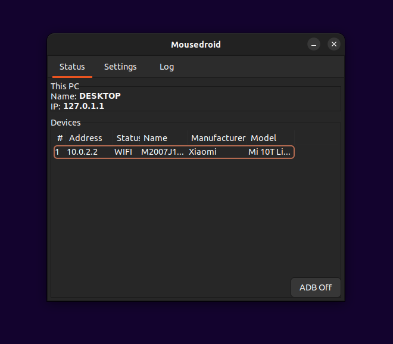
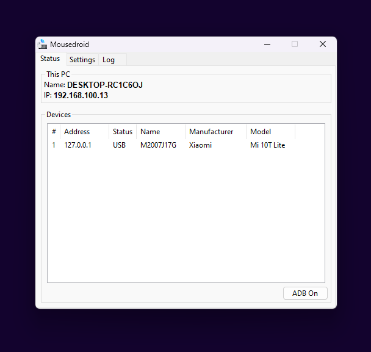

<h1  align="center">
  
    </img>
  
  Mousedroid
</h1>

Use your android phone as a mouse & keyboard.

***

 </img>
 </img> 

## Description

Cross platform application that transforms your android phone in an input peripheral. Use it as a mouse (touchpad), keyboard or numpad. Wired or wirelessly, control your pc with your phone.

### Supported platforms:
- Windows
- Linux
- Android 8 (Oreo) and newer
  
  
## How to use
1. Download ( or build ) and install the server on your pc. [How to build](https://github.com/hypertensiune/Mousedroid/tree/main/server)
2. Download and install the APK on your phone from the.
3. If you want to use the application in ***WIFI*** mode, make sure your phone is connected to the same network as the pc.  
   If you want to use it ***wired***, you must enable `USB Debugging` under `Developer options` on your phone. ([See](https://developer.android.com/tools/adb) for more details)
4. Start the server. ( If you start the server after connecting your phone via USB you need to restart ADB )
5. For ***WIFI*** mode add the IP Address of your server and connect to it.

## Notes

- If you start the server after connecting your phone via USB you need to restart ADB
- On Wayland some features, like the taskbar icon may not be visible, switching to Xorg might solve the issue.
